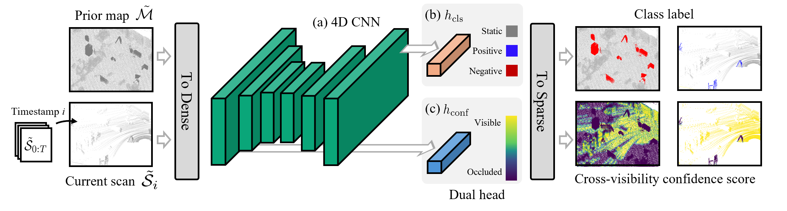

<div align="center">

# Chamelion

### Reliable Change Detection for Long-Term LiDAR Mapping<br>in Transient Environments

**Seoyeon Jang · Alex Junho Lee · I Made Aswin Nahrendra · Hyun Myung**<br>
IEEE Robotics and Automation Letters, 2026

[](https://doi.org/10.1109/LRA.2026.3665079)
[](https://chamelion-pages.github.io/)
[](https://huggingface.co/datasets/se0yeon00/Const_pseudo_dataset)
[](https://huggingface.co/se0yeon00/Chamelion)

[Setup](#-setup) · [Dataset](#-dataset) · [Training](#-training) · [Inference](#-inference)



Detect added and removed objects by comparing LiDAR scans with a prior map.

</div>

## 🚀 Setup

Requires Linux, an NVIDIA GPU, and Docker with GPU support. Run all host commands
from the repository root after cloning:

```bash
git clone --branch main --recurse-submodules https://github.com/url-kaist/chamelion.git
cd chamelion
./scripts/build.sh
```

This builds `chamelion:train-cu128` for training and inference.

## 📦 Dataset

Choose how you want to prepare your data:

- **[Download the prepared pseudo dataset](#option-a--download-the-pseudo-dataset)** to start training with our supplied splits.
- **[Generate your own pseudo dataset](#option-b--generate-your-own-pseudo-dataset)** from LiDAR clouds and matching poses.

### Option A — Download the pseudo dataset

**[Const_pseudo_dataset on Hugging Face ↗](https://huggingface.co/datasets/se0yeon00/Const_pseudo_dataset)**<br>
Prepared point clouds, poses and labels. Approximately **3.61 GiB**; no pseudo generation needed.

| Split | Submaps | Scans |
| --- | ---: | ---: |
| Train | 62 | 5,877 |
| Validation | 12 | 1,158 |
| Test (Const-1F, Lab) | 2 | 2,296 |

```bash
pip install huggingface_hub
```

Download to a new directory. No login, conversion, or renaming is needed:

```python
from huggingface_hub import snapshot_download

snapshot_download(
    repo_id="se0yeon00/Const_pseudo_dataset",
    repo_type="dataset",
    local_dir="/path/to/Const_pseudo_dataset",
)
```

Use `/path/to/Const_pseudo_dataset/sequences` for [Training](#-training)
or [Inference](#-inference). The supplied configuration selects the training
and validation splits; test data is excluded from training.

<details>
<summary>Dataset structure and label format</summary>

Keep `checksums.json`, `splits/` and `sequences/` together:

```text
Const_pseudo_dataset/
├── checksums.json
├── splits/                       # train.txt, val.txt, test.txt
└── sequences/sequence_000/
    ├── poses.txt
    └── submaps/submap_000/
        ├── prior_map.pcd
        ├── scans/                # 000000.pcd, …
        ├── scan_labels/          # 000000.label, …
        └── map_labels/static.label
```

Each submap has one shared map label file, `map_labels/static.label`.
Each scan has a label file with the same filename stem. Labels are binary `int32`,
one per point in cloud order:

| Label | Meaning |
| --- | --- |
| `0` | Static |
| `1` | Added |
| `2` | Removed |
| `-1`, `251` | Ignored (`251` occurs in the test data) |

Maps and scans share a global coordinate frame. Each `poses.txt` row is a
row-major 3×4 local-to-global transform (12 numbers). Scan `000123.pcd` uses
pose row 123, counting from zero. Keep scan numbers and pose rows unchanged,
even when using only part of a sequence.

</details>

<a id="-generate-your-own-data"></a>

### Option B — Generate your own pseudo dataset

Start with **LiDAR clouds + matching `poses.txt`**. This interactive workflow uses
the [TRAVEL](https://github.com/url-kaist/TRAVEL) submodule and a Linux graphical
desktop with Docker and `xauth`.

**[Screenshot walkthrough →](docs/pseudo_generation_visual_guide.md)**

[](docs/pseudo_generation_visual_guide.md)


**1. Prepare the input**

```text
source_dataset/
└── sequences/
    └── my_sequence/
        ├── poses.txt
        └── clouds/
            ├── 000000.bin
            ├── 000001.bin
            └── …
```

Use sensor-coordinate float32 XYZI `.bin` clouds, numbered from zero without gaps.
Each line of `poses.txt` is a row-major 3×4 sensor-to-world transform (12 numbers),
matching the cloud with that frame number. No input labels are needed.

<details>
<summary>PCD input or multiple recording sessions</summary>

For PCD input, use `000000.pcd`, `000001.pcd`, … in `clouds/` and set
`load_dataset.is_bin: false` in `/output/generator.yaml` before step 3.
Each recording session gets its own folder under `sequences/`, with its own
`poses.txt` and `clouds/`. Process one session at a time.

</details>

**2. Build and open the GUI container**

```bash
bash scripts/build.sh pseudo
bash scripts/generate.sh /path/to/source_dataset my_sequence
```

Pass the folder **containing `sequences/`**, followed by the session name.
Inputs are read-only. The launcher prints a fresh output directory on the host;
inside the container it is `/output`.

**3. Run these commands inside the container, one at a time**

```bash
# Segment ground and cluster objects
python3 pseudo_generator/label_instances.py /output/generator.yaml

# Select dynamic objects to remove and review the static map
python3 pseudo_generator/prepare_objects.py /output/generator.yaml

# Pick locations, place objects, and save the pseudo dataset
python3 pseudo_generator/generate_changes.py /output/generator.yaml
```

| Action | Control |
| --- | --- |
| Select / undo a point | **Shift + left click** / **Shift + right click** |
| Continue or accept the preview | **Q** |
| Finish removal | Select no points, then **Q** in both windows |
| Place all selected objects | Pick all locations, then **Q** |
| Retry / cancel a review | **R** / **X** |

🟢 Ground · ⚪ Non-ground · 🔵 Added objects · 🔴 Removed objects

**4. Use the generated dataset**

Output is saved to `/output/Const_pseudo_dataset/`, using the same structure as
Option A. Train on its **host-side `sequences/` directory**, not the input `clouds/`.

Create train/validation split files listing one submap per line, for example
`sequence_000/submaps/submap_000`. Point `training.train_split` and
`training.val_split` in [`config/cham.yaml`](config/cham.yaml) to these files
(paths are relative to the config). Keep each source session in only one split;
the bundled splits apply only to the downloaded dataset.

## 🏋️ Training

Point the launcher at your downloaded or generated **`sequences` directory** and choose an
output directory for caches and checkpoints:

```bash
CHAMELION_DATASET_PATH=/path/to/Const_pseudo_dataset/sequences \
CHAMELION_OUTPUT_PATH=/path/to/training_output \
./scripts/train.sh
```

The default runs **50 epochs** using [`config/cham.yaml`](config/cham.yaml).
The dataset is mounted **read-only**; outputs go to the directory you selected.

## 🔎 Inference

Evaluate scan changes and the final map using **scan IoU** and **map PR, RR and F1**.
Inference settings are in [`config/inference.yaml`](config/inference.yaml).

### Pretrained weights

Download the public [pretrained weights](https://huggingface.co/se0yeon00/Chamelion)
and matching inference settings from the repository root. No login is needed:

```python
from huggingface_hub import hf_hub_download

for filename in ("chamelion_pretrained.pt", "inference.yaml"):
    hf_hub_download("se0yeon00/Chamelion", filename, local_dir="pretrained")
```

### Run on Const-1F

```bash
CHAMELION_DATASET_PATH=/path/to/Const_pseudo_dataset/sequences \
CHAMELION_OUTPUT_PATH=/path/to/new_test_run \
bash scripts/evaluate.sh pretrained/chamelion_pretrained.pt \
  --inference-config pretrained/inference.yaml \
  --profile custom \
  --sequence sequence_005/submaps/submap_000
```

Results are saved under `new_test_run/results/`: metrics, frame previews, and
the final map (`final_map.npz` and `final_map.png`).

<details>
<summary>Optional: view saved results</summary>

On a Linux graphical desktop with `xauth`, build the viewer once and open the results:

```bash
bash scripts/build.sh viewer
bash scripts/view.sh evaluation /path/to/new_test_run/results
```

The Polyscope viewer shows **Input**, **Prediction**, **Ground truth**, and
**Errors** without rerunning inference. Add `--save-all-frames` to the evaluation
command if you want to save every frame for viewing.

</details>

<details>
<summary>Optional: interactive inference on your own data (no labels needed)</summary>

Provide a global-coordinate prior map, numbered PCD scans, and their full pose
table. Requires a Linux graphical desktop with `xauth` and an NVIDIA GPU.
This viewer runs **single-frame predictions**, without map accumulation.

```bash
bash scripts/build.sh viewer
bash scripts/view.sh inference pretrained/chamelion_pretrained.pt \
  /path/to/prior_map.pcd /path/to/scans /path/to/poses.txt global
```

Use `global` for the released dataset's scans, or `local` for sensor-coordinate
scans. No GT labels are required. Select a frame, click **Run inference on this
frame**, then **Save prediction**. The launcher prints the output directory.

</details>

## 📄 Citation

If you use Chamelion in your research, please cite:

```bibtex
@article{jang2026chamelion,
  title   = {Chamelion: Reliable Change Detection for Long-Term LiDAR Mapping in Transient Environments},
  author  = {Jang, Seoyeon and Lee, Alex Junho and Nahrendra, I Made Aswin and Myung, Hyun},
  journal = {IEEE Robotics and Automation Letters},
  year    = {2026},
  doi     = {10.1109/LRA.2026.3665079}
}
```

### Acknowledgments

We thank [MapMOS](https://github.com/PRBonn/MapMOS) and
[TRAVEL](https://github.com/url-kaist/TRAVEL) for their open-source code.

### License

Chamelion is distributed under the [GNU General Public License v3.0 or later](LICENSE)
(`GPL-3.0-or-later`). Third-party components retain their original license notices.
Datasets and pretrained weights use [CC BY-NC-ND 4.0](https://creativecommons.org/licenses/by-nc-nd/4.0/).
