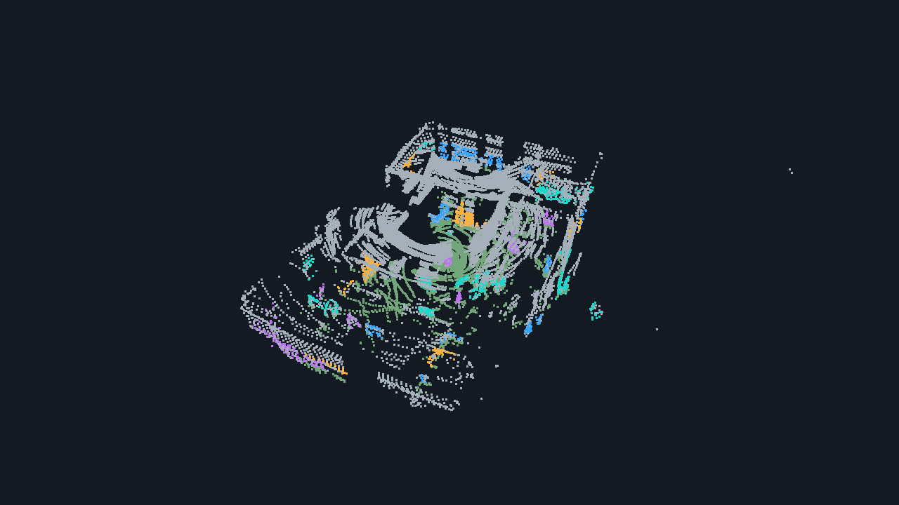
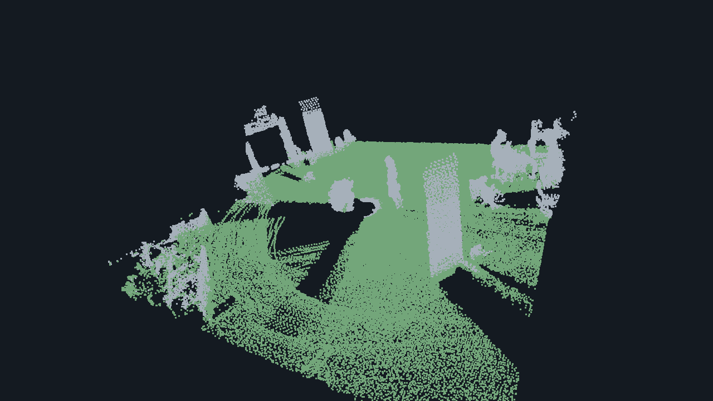
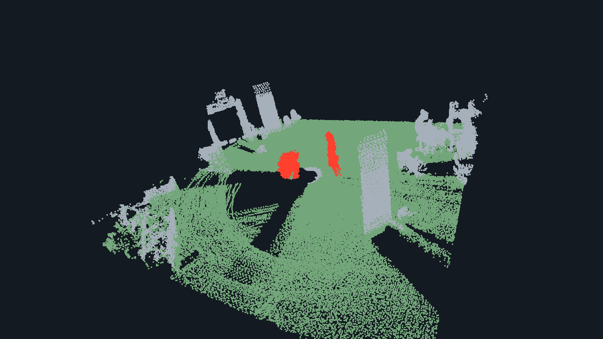
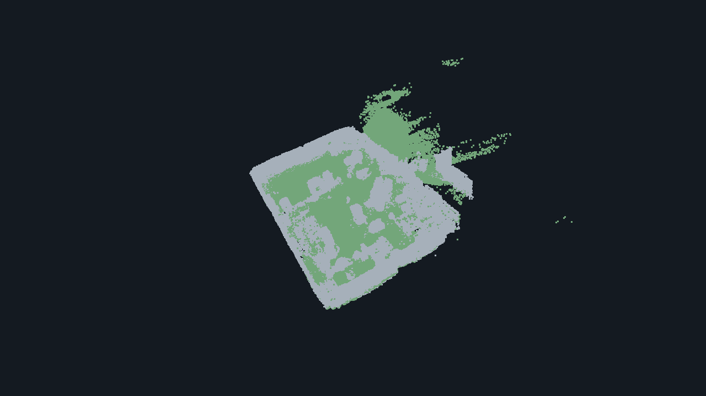
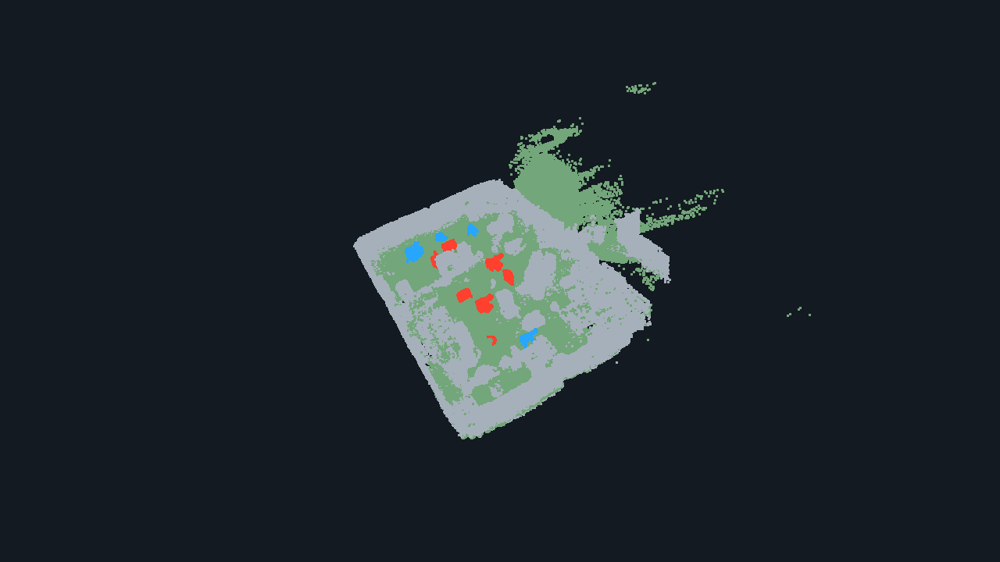

# Make a pseudo dataset: a visual walkthrough

[← README](../README.md#-generate-your-own-data)

You do **not** label every point by hand. TRAVEL finds ground and objects;
tracking proposes moving objects. You review what to remove, then choose where
to place change objects. The generator writes the point labels for you.

**Two different picking tasks:** first click **objects to remove**; later click
**ground locations where objects should be placed**.

> Images illustrate the workflow using saved data and reconstructed cleanup
> examples, rather than a recorded annotation session.

## Before you start

On a Linux graphical desktop with Docker and `xauth`, run from the repository root:

```bash
git submodule update --init --recursive
bash scripts/build.sh pseudo
bash scripts/generate.sh /path/to/source_dataset my_sequence
```

The input must contain `sequences/my_sequence/poses.txt` and
`sequences/my_sequence/clouds/000000.bin`, `000001.bin`, … . The default clouds
are float32 XYZI, with one row-major 3×4 pose per frame. For PCD input set
`load_dataset.is_bin: false` in `/output/generator.yaml` before labeling.

The launcher opens a container and prints a **new host output directory**. Keep
that path: `/output` below refers to it. Run the following commands **inside that
container**, one at a time. Your input is mounted read-only at `/input`.

Press **Q** to continue or accept a review. **X** or closing a review cancels;
previously saved output is retained.

| Command | What happens | Your job |
| --- | --- | --- |
| `label_instances.py` | Ground + object segmentation | Inspect the first frame |
| `prepare_objects.py` | Tracking → removal → static map | Choose objects to remove, approve the map |
| `generate_changes.py` | Placement → review → export | Pick locations, approve all changes together |

## 1. Inspect the segmentation — no picking yet

```bash
python3 pseudo_generator/label_instances.py /output/generator.yaml
```



**Look for:** green ground and colored object clusters. Gray points are other or
unassigned points. Cluster colors repeat; they do not identify object classes.
**Blue at this stage does not mean an added change.**

**Do:** rotate by dragging; zoom with the wheel. Press **Q** to continue labeling
the remaining frames. There is no need to select anything in this preview.

**Wait for:** the terminal's `Labeled … scans` message and `Next:` command.

## 2. Remove unwanted moving objects

```bash
python3 pseudo_generator/prepare_objects.py /output/generator.yaml
```

First, tracking runs automatically in the terminal. It matches objects across
frames and identifies moving tracks; **no clicking is needed while it runs**.
Wait for the removal picking window. That window shows retained candidate
objects, not the full scene or a ground map.

### A. Select residual dynamic traces in the accumulated submap



*Frames 000000–000099 accumulated using their poses, with retained tracked objects.
The two central traces are the cleanup targets in this example. Green ground is
shown for spatial context; the actual picking window shows candidate objects only.*

**Do:** look for residual moving-object traces left in the accumulated scene.
Hold **Shift** and **left-click a point on each trace** that should not
remain in the static map. One point selects its **whole tracked object**, not
just that frame or point. Select all unwanted tracks in
this batch. **Shift + right click** undoes a point selection.

Press **Q** to open the review. This first **Q does not confirm deletion**.

### B. Check the red objects before confirming



*Same crop and camera, with selected tracks highlighted in red.*

**Look for:** red = remove; gray = keep.

- Correct selection? Press **Q** to confirm this batch.
- Wrong selection? Press **R** to retry before confirming.
- Finished removing objects? In the next picking window select **nothing**, press
  **Q**, then press **Q** again in `Finish removal?`.

Confirmed batches cannot be individually undone.

### C. Check what remains after removing the traces


The selected traces are gone; surrounding points remain. Repeat selection if
more unwanted traces remain, then finish removal as described above.

## 3. Approve the static map — same command, new window

**Do not launch another script.** Preparation now builds the static scans/map
and opens this preview:



**Look for:** green ground, gray non-ground, and whether unwanted moving objects
remain. **Do:** press **Q** to accept the prepared map.

**Wait for:** preparation to finish and print the generation `Next:` command.

## 4. Pick placement locations — click the ground this time

Run the exact **`Next:` command** printed by preparation. For a first run it is:

```bash
python3 pseudo_generator/generate_changes.py /output/generator.yaml
```

The picking window shows the green/gray prepared map above. Here you are **not
selecting objects to remove**. You are choosing **where change objects will appear**.

**Do:** **Shift + left click** on several suitable ground points. Pick all the
locations you want for this chunk, then press **Q once**. All objects appear
together; there is no separate button or confirmation for each object.

The generator chooses objects from the prepared database. It assigns
`floor(0.7 × number of locations)` as removed changes and the rest as added
changes. A single location produces only an added object; choose several
locations to see both types. You do not choose change types by clicking colors.

## 5. Review the changes, then save



*Saved changes in one submap and scan; filtering can make the saved result
differ from the placement preview.*

**Look for:**

| Color | Meaning | Where the points are saved |
| --- | --- | --- |
| Blue | Added object: present now, absent from the prior map | Current scans, label `1` |
| Red | Removed object: present in the prior map, absent now | Prior map, label `2` |
| Green / gray | Ground / non-ground display colors | Not change-label classes |

Press **Q** in the combined preview to **save the whole chunk**. Press **R** to
discard the draft and choose locations again.

The terminal shows export progress. Wait for it to finish. For longer recordings,
the placement window opens again for the next 100-frame chunk.

```text
Const_pseudo_dataset/sequences/sequence_000/
├── poses.txt
└── submaps/submap_000/
    ├── prior_map.pcd
    ├── scans/
    ├── scan_labels/
    └── map_labels/static.label
```

Use the output path printed in the terminal. Before training, configure your
train/validation splits as described in the [README](../README.md#option-b--generate-your-own-pseudo-dataset).
